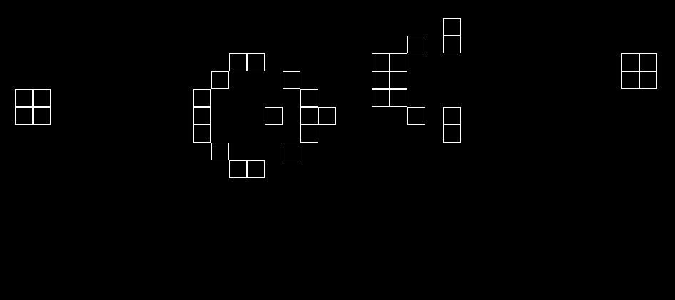

# Game of Life

Conway's Game of Life made in Python.



## Installation

1. Clone this repo:

```bash
git clone https://github.com/ziebam/game_of_life.git
```

2. Set up a venv and activate it, e.g.:

```bash
python -m venv venv

# Windows.
.\venv\scripts\activate

# Unix.
source venv/scripts/activate
```

3. Install the application locally.

```bash
pip install game_of_life
```

## Usage

1. Run the application as a module. This will default to a randomly generated 25x25 board.

```bash
python -m game_of_life
```

2. Optionally, you can specify the size yourself...

```bash
python -m game_of_life random 15 15
```

3. ...or load a pattern from a .txt file. The file has to reside in the `patterns/` directory. Zeros in the file represent dead cells, and ones represent live cells.

```bash
python -m game_of_life file gosper_glider_gun.txt
```

## License

[MIT](LICENSE)
